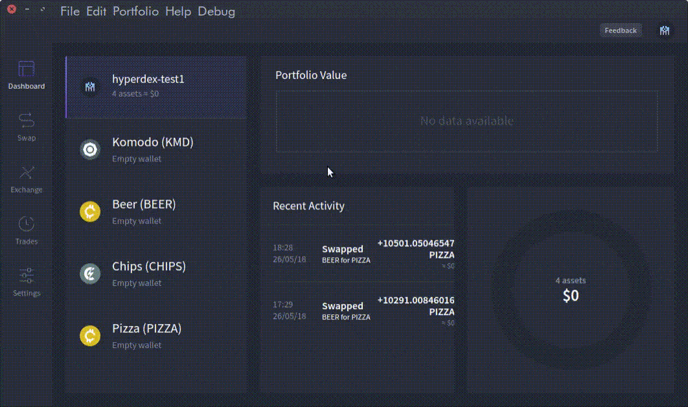

*************************
HyperDEX: Enable Currency
*************************
.. note::

	This is a WIP document

How to
======

* Start the HyperDEX app.
* Click on the Settings menu on the Left side (``LHS``) of the screen.
* Click on the box in the middle with different currency names in it.
* Select the :ref:`coins/list` coins/tokens/assets you wish to trade in from the drop-down menu.

The process can be seen in the gif below:

